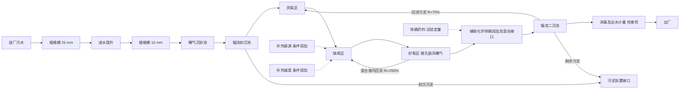

# 第 3 项 工艺方案与设计参数确定

日期：2026-09-09。状态：本项方案、接口计算及参数选取已完成，供用户审核；GitHub 自审合并不等同于用户确认工艺达标或授权下一项。

本轮补齐此前缺失的第 3 项。核对时仓库 main 已包含第 4–9 项，采用两级格栅、曝气沉砂、辐流初沉、A²/O 和微孔鼓风曝气。本项在这些已有成果基础上补充工艺比选、统一参数依据和适用条件。第 4–9 项的计算尺寸不在本项重算；其中尚未闭合的假定仍需复核，不能因补齐工艺说明而自动视为已验证。

## 1 采用方案与比选

建议采用：**两级机械格栅 → 曝气沉砂 → 辐流初沉 → A²/O → 辐流二沉**，粗格栅后提升；生物段预留补碳和补碱接口，好氧末端至二沉前设置辅助化学除磷投加及混合接口。二沉后在总流程中保留消毒和出水计量位置，其详细计算属于大纲完善项，后续明确设备与水头损失。

推荐理由：任务书同时控制 BOD₅、氨氮、TN、TP；厌氧、缺氧、好氧分区分别承担释磷、反硝化以及碳氧化/硝化/吸磷，配合排放富磷剩余污泥实现净除磷。连续流并联布置与教案初沉—曝气—二沉框架及仓库现有成果一致。比选顺序为“先确认污染物目标—再比较脱氮除磷能力—最后检查与已算构筑物、占地和运行条件的兼容性”，而不是只列工艺名称。基于该顺序，A²/O 作为主方案，A/O+化学除磷作为条件性备选；本题碳源与碱度资料不足，因此主方案须配套补碳和化学除磷能力，不能仅凭经验去除率保证出水。

| 比选方案 | 与本题的关系 | 本项判断 |
| --- | --- | --- |
| 普通好氧活性污泥法 | 主要处理有机物；仅设置好氧池不能充分交代反硝化和强化生物除磷 | 不作为完整方案 |
| 缺氧/好氧 A/O + 化学除磷 | 生物段重点脱氮，磷依靠化学辅助；仍须校核碳源、碱度和药剂污泥 | 可行备选；若后续生物除磷收益不足，可重新比选，不能本轮直接替换已算的 A²/O |
| 厌氧/缺氧/好氧 A²/O + 辅助化学除磷 | 可分别组织脱氮除磷计算；与既有第 8、9 项一致 | 本项推荐；须补齐本文件第 6 节条件 |
| 分区氧化沟 | 可结合厌氧区及缺氧运行实现脱氮除磷，但须重新匹配循环流量、供氧设备和布局 | 本轮不选；尚无占地、能耗、投资定量对比，不能声称必然优于或劣于 A²/O |

依据：GB 50014-2021 第 7.6.1、7.6.16–7.6.24 条；HJ 576-2010 第 3、4.1、5.2.3 节及教案 PDF 47–50 页。上述比选结论属于本项目工程判断。

## 2 流程、并联及回流边界

图示代表每条水线的处理顺序；全厂为两条并联运行水线。每级格栅全厂 2 格且正常同时运行；每线设 1 座曝气沉砂池、2 座初沉池、2 个生物系列。为避免“每线两组、每组两系列”的歧义，全文统一写为：**全厂 4 个相互独立的 A²/O 系列**。二沉池为全厂 6 座、每线 3 座，不直接等同于生物系列数。

提升后拟采用重力流逐级衔接，第 13 项结合实际组号、洪水位及水头损失验证。检修闸门与联通设施不能替代检修期间的处理能力校核。回流污泥可能携带硝酸盐，故 RAS 回厌氧区并不意味着厌氧条件自动成立；应控制携氧与硝酸盐，必要时另行论证预缺氧措施。

以单个系列的外部进水 Q 为基准，R=Q_R/Q，Ri=Q_i/Q。忽略排泥水量、投药水量及其他侧流的初步水量关系为：

| 位置 | 实际经过的流量关系 | 说明 |
| --- | --- | --- |
| 厌氧区入口 | Q+Q_R=1.75Q | 外部初沉出水与回流污泥混合 |
| 缺氧及好氧区入口 | Q+Q_R+Q_i=4.25Q | 加入好氧末端内回流 |
| 好氧末端至二沉 | Q+Q_R=1.75Q | 内回流在此之前分出 |
| 二沉澄清出水 | 约 Q | 回流污泥在二沉池分离，不增加厂外进水负荷 |

上表用于后续连接管渠和局部过流计算。名义 HRT 采用池容除以外部平均进水量；不能与含回流的单程通过时间混用。二沉表面出水水力负荷通常按 Q，固体负荷按实际进池混合液流量及 MLSS 计算；化学除磷固体另计。日平均污染负荷不得乘 R、Ri 或 Kz。

## 3 初沉后水质与处理接口计算

### 3.1 输入及初沉去除率

沿用第 1、2 项：Q=108000 m³/d；BOD₅、SS、TN、TP 平均日负荷分别为 18000、30000、4800、600 kg/d。浓度由负荷反算，计算过程保留未舍入数值。

本项接受第 7 项作为当前课程接口的初沉去除率：BOD₅ 25%、SS 50%、TP 7.5%；TN 暂不计去除。前三项分别落在 GB 50014-2021 表 7.1.2 的初级沉淀经验范围 20%–30%、40%–55%、5%–10% 内。**TN 不计去除是负荷保守假定，不是该表规定的 0% 去除率。** 初沉效率与来水组分、运行时间相关，选定水力参数不等于证实了实际效率。

对指标 i：

$$
C_{i,1}=C_{i,0}(1-r_i),\quad L_{i,1}=L_{i,0}(1-r_i),\quad L_{i,\mathrm{out}}=Q C_{i,e}/1000
$$

浓度单位 mg/L，流量单位 m³/d，负荷单位 kg/d，r 为无量纲去除率。栅渣、砂及预曝气导致的 BOD/TN/TP 变化暂无定量资料，不在本级另扣，防止重复计量。

| 指标 | 初沉去除率 | 初沉去除量 kg/d | 生物段外部进水 mg/L | 生物段外部负荷 kg/d | 出厂允许负荷 kg/d | 初沉后尚需净去除 kg/d |
| --- | ---: | ---: | ---: | ---: | ---: | ---: |
| BOD₅ | 25% | 4500 | 125.00 | 13500 | 2160 | 11340 |
| SS | 50% | 15000 | 138.89 | 15000 | 2160 | 12840 |
| TN | 0%（假定） | 0 | 44.44 | 4800 | 2160 | 2640 |
| TP | 7.5% | 45 | 5.1389 | 555 | 108 | 447 |

例如 BOD₅：18000×(1−0.25)=13500 kg/d，13500×1000/108000=125 mg/L；TP：600×(1−0.075)=555 kg/d，555×1000/108000=5.1389 mg/L。

初沉后至出厂所需净削减比例分别为 84.00%、85.60%、55.00%、80.54%。SS 的净削减量不是二沉池全部固体负荷：生物池产生的新污泥、回流固体及药剂沉淀也进入二沉系统。BOD₅ 11340 kg/d 是后续碳氧化计算的接口，仍须区分有机物同化、内源呼吸和反硝化，不能直接视为等量氧气。

每条水线质量负荷为表中一半，每个生物系列外部质量负荷为四分之一，浓度不变。

### 3.2 碳源条件及初沉旁路的作用

$$
\left(BOD_5/TN\right)_0=18000/4800=3.75
$$

$$
\left(BOD_5/TN\right)_1=13500/4800=2.8125
$$

$$
\left(BOD_5/TP\right)_1=13500/555=24.3243
$$

HJ 576-2010 第 5.2.3 节采用 BOD₅/TN≥4 及 BOD₅/TP≥17 作进水条件筛查。GB 50014-2021 第 7.6.16 条的脱氮比值分母是**总凯氏氮 TKN**，不是 TN；其 BOD₅/TKN 宜大于 4。TN 包括 TKN 和硝酸盐/亚硝酸盐氮，本题 TKN 缺失，不能把 2.8125 直接写成已测的 BOD₅/TKN。

因此：按 HJ 的 TN 筛查存在碳源不足风险；按 GB 的 TKN 条件尚不能独立判定。BOD₅/TP 达到筛查值也不能证明 VFA 充足或已实现净除磷。

为量化筛查差额，在维持 TN 和水量不变、仅将 BOD₅/TN 提高至 4 的假定下：

$$
\Delta C_{B,\mathrm{screen}}=4\times\frac{4800\times1000}{108000}-125
=52.7778\ \mathrm{mg/L}
$$

$$
\Delta L_{B,\mathrm{screen}}=4\times4800-13500=5700\ \mathrm{kgBOD_5/d}
$$

**5700 kgBOD₅/d 仅为筛查等效差额，不是乙酸钠、甲醇等商品药剂日投加量，也不是本厂已确定的实际缺碳量。** 药剂需求应按可利用碳源、需反硝化氮量、药剂纯度/COD 当量和试验结果求取；不能直接将 BOD₅ 当成可快速利用的 COD。

若将通过预处理的污水按比例 f 绕过初沉、与初沉出水混合，在上述效率固定且 TN 不去除假定下：

$$
C_{B,\mathrm{mix}}=125+41.6667f,\qquad
\left(BOD_5/TN\right)_{\mathrm{mix}}=2.8125+0.9375f
$$

0≤f≤1 时，比值最大只有 3.75。因此缩短初沉或部分旁路可保留一些碳源，但不能单独保证满足上述筛查条件，且会增加生物段 SS、有机负荷与供氧要求。本项主算 f=0，保留初沉；旁路仅为需重新计算的运行备选，不把未设计的旁路当作达标措施。

初沉 BOD₅ 去除率在 20%、25%、30% 时，初沉出水 BOD₅ 分别为 133.33、125.00、116.67 mg/L，对应 BOD₅/TN 为 3.00、2.8125、2.625。去除有机物越多，后续碳源筛查条件越不利。

## 4 统一设计参数表

下表“采用值”用于当前课程方案。已由第 4–9 项采用的值是既有工程选值；新增的二沉参数是初选值，须在第 10 项计算后更新。参数进入参考范围仅完成选值核对，不能替代处理能力校核。

### 4.1 水量、前处理及沉淀

| 参数 | 采用值或控制值 | 来源、页码与应用 |
| --- | --- | --- |
| 全厂平均水量 | 108000 m³/d | 第 1 项已通过；生物平均质量负荷基础 |
| 课程峰值 | 1.625 m³/s=5850 m³/h | 第 1 项 Kz=1.3；峰值折算日量不是实测最高日水量 |
| 并联方式 | 两水线；生物共 4 系列 | 教案 PDF 50；系列数承接第 8 项 |
| 粗/细格栅 | 25/10 mm，机械清渣 | 第 4 项；GB 7.3.2，书内 47/PDF 55，机械粗栅 16–25 mm、细栅 1.5–10 mm |
| 格栅角度/目标过栅流速 | 60°/0.90 m/s | 第 4 项；GB 7.3.3，同页，范围 60°–90°/0.6–1.0 m/s；实际值见第 4 项 |
| 格栅运行 | 每级2格、正常2格并联 | 第4项教师审阅修订；单格按单线峰值校核，检修期限流 |
| 提升位置 | 粗栅后、细栅和沉砂前 | 教案 PDF 52；第 5 项；扬程待第 13 项闭合 |
| 沉砂形式 | 曝气式，两座 | 教案 PDF 36–39；第 6 项 |
| 沉砂停留时间/水平流速 | 峰值 t>5 min，v≤0.10 m/s | GB 7.4.3，书内 48/PDF 56；第 6 项实际 5.08 min、0.0985 m/s，符合条件 |
| 沉砂水深/宽深比 | 2.50 m/1.32 | 第 6 项；GB 7.4.3，范围 2–3 m/1–1.5 |
| 沉砂供气强度 | 6 L/(m·s)，按池长 | 第 6 项；GB 7.4.3 范围 5–12，同页；不与 m³空气/m³污水混用 |
| 设计砂量/贮砂期 | 0.03 L/m³、2 d | GB 7.4.5–7.4.6，书内 49/PDF 57；第 6 项 |
| 初沉形式 | 中心进水周边出水辐流式，机械刮泥，共 4 座 | 第 7 项；GB 7.5.12，书内 51/PDF 59 |
| 初沉峰值表面负荷 | 初选 2.50 m³/(m²·h) | 第 7 项取整后 2.375；GB 表 7.5.1，书内 49/PDF 57，范围 1.5–4.5 |
| 初沉池/水深/超高 | 4座D31；3.00/0.50 m | 第7项教师审阅修订；净面积扣D4.5中心井，峰值表面负荷1.979 |
| 初沉停留时间 | 参考 0.5–2.0 h | GB 表 7.5.1；第 7 项峰值 1.474 h、平均 1.916 h |
| 初沉最大堰负荷 | ≤2.9 L/(m·s) | GB 7.5.8，书内 50/PDF 58；不是表面负荷 |
| 二沉形式 | 中心进水周边出水辐流式，连续收排泥 | 本项初选；GB 7.5.5、7.5.12；池数待第 10 项 |
| 二沉峰值表面负荷/有效水深 | 初选 1.00 m³/(m²·h)/3.00 m | GB 表 7.5.1、7.5.3，书内 49/PDF 57；活性污泥二沉范围 0.6–1.5、2–4 m |
| 二沉沉淀时间/固体负荷 | 参考 1.5–4.0 h；≤150 kg/(m²·d) | GB 表 7.5.1；固体负荷须含 RAS 对进池量的影响及化学固体，不取周边进出水池的 200 上限 |
| 二沉堰负荷/超高 | ≤1.7 L/(m·s)/初取 0.50 m | GB 7.5.8、7.5.2；第 10 项复核 |

版本说明：GB 7.4.3 的文字为“停留时间宜大于 5 min”，不是“不小于 5 min”；第 6 项实际 5.08 min 无需因措辞修改尺寸。旧教案/手册较短的沉砂时间仅作为版本对照。流量系数仍按第 1 项已通过的课程口径，不将整套方案声称为完全按现行工程标准设计。

### 4.2 生物反应、回流及除磷

| 参数 | 当前采用值 | 来源、页码、适用条件 |
| --- | --- | --- |
| 生物工艺 | A²/O 连续流廊道式 | 第 8 项；GB 7.6.19，书内 59–60/PDF 67–68 |
| MLSS X | 3.5 g/L=3.5 kg/m³ | 第 8 项；表 7.6.19，范围 2.5–4.5 |
| 总名义 HRT | 10.8 h | 第 8 项既有值；表 7.6.19，范围 10–23 h，按外部平均进水定义 |
| 厌氧/缺氧/好氧名义 HRT | 1.5/3.0/6.3 h | 第 8 项；厌氧 1–2 h、缺氧 2–10 h 见表 7.6.19；好氧为已有分区值，仍需硝化动力学校核 |
| 系统污泥龄 SRT | 初定 15 d | 第 8 项；表 7.6.19 范围 10–22 d；不等于好氧污泥龄 |
| BOD₅ 污泥负荷 | 参考 0.05–0.10 kgBOD₅/(kgMLSS·d) | 表 7.6.19；第 8 项全池按进水为 0.0794、净去除为 0.0667，需注明分子与池容边界，勿混用好氧区专用公式 |
| R/内回流 Ri | 75%/250%，相对于外部 Q | 第 8 项；表 7.6.19 分别 20%–100%/≥200%；第 7.6.17 条内回流不宜超过 400% |
| 有效水深/超高 | 5.0/0.5 m | 第 8 项、教案 PDF 47；GB 7.6.2、7.6.5，书内 52/PDF 60 |
| 厌氧区 DO | <0.2 mg/L | 本项运行目标；HJ 576 第 3.2 节，书内 2/PDF 7；另需避免硝酸盐干扰 |
| 缺氧区 DO | 0.2–0.5 mg/L | 本项运行目标；HJ 576 第 3.3 节，同页 |
| 好氧区 DO | 2.0 mg/L，随硝化情况调节 | 第 9 项；HJ 576 第 3.4 节以一般不小于 2 mg/L 描述好氧区 |
| 厌氧/缺氧搅拌 | 初取 5 W/m³ | 本项工程初选；GB 7.6.6，书内 52/PDF 60，范围 2–8 W/m³；设备功率及布点另核 |
| 污泥产率 Y | 0.50 kgVSS/kgBOD₅ | 第 8 项；表 7.6.19 范围 0.3–0.6；勿与总 MLSS 产率混用 |
| Kd20 /温度系数 | 0.060 d⁻¹/1.04 | 第 8 项；GB 7.6.10–7.6.11，书内 53–54/PDF 61–62，分别 0.040–0.075/1.02–1.06 |
| MLVSS/MLSS | 0.75 | 第 8 项工程假定，非题设测值；需配合固体平衡复核 |
| 生物控制温度 | 暂按冬季平均 15 ℃；夏季 25 ℃ | 任务书；平均温度不等于最不利设计最低温，低温硝化仍需复核 |
| 鼓风曝气 | 好氧区微孔曝气，分区可调 | 第 9 项；供气设备为既有估算方案，不在本项重新定型 |
| 辅助化学除磷 | 好氧末端之后、二沉前投加并混合 | GB 7.10.1–7.10.6，书内 73/PDF 81；铝盐/铁盐经试验选药、定量；计入新增污泥和碱度影响 |
| 好氧剩余碱度 | >70 mg/L，以 CaCO₃ 计 | GB 7.6.16，书内 55/PDF 63；缺少进水碱度，不能宣称已满足 |

回流污泥浓度 8.0 kg/m³在第 8 项是初步接口值，不能独立于 R、MLSS、排泥及出水固体随意固定。第 10 项必须用完整固体平衡确定最终回流浓度和排泥量。

## 5 参数选取与后续尺寸的关系

本项将既有数值归并为统一接口，不新增池体尺寸。生物池应按碳去除、硝化、反硝化分别检查有效容积和泥龄；不能仅按总 HRT 满足范围就确认全部分区能力。回流不得从二沉池误画为“硝化混合液内回流”，内回流抽取点明确在好氧末端、进入二沉之前。

初沉出水 TP 为 555 kg/d，允许出厂 108 kg/d，生物与辅助化学除磷合计需要至少削减 447 kgP/d。第 8 项已报告生物排泥带磷可能不足，故本方案将辅助化学除磷作为必要保障接口，不能将生物除磷经验范围直接当成 447 kgP/d 的已实现量。具体药量和污泥量取决于可沉淀磷、净排泥含磷率、药剂及混凝试验。

二沉 SS 与 TP 有关联：未截留的含磷污泥会抬高出水 TP。二沉水力、固体负荷、污泥沉降和化学絮体影响必须一起校核，单独算 TP 投药量不能保证出水 SS≤20 mg/L。

## 6 待闭合条件与复用规则

| 条件 | 当前处理方式 | 何时闭合/可能影响 |
| --- | --- | --- |
| COD、可利用 COD、VFA | 保留缺项；不填手册典型值，不确定补碳药量 | 生物/补碳校核前补资料；改变碳负荷后须回算第 8、9 项 |
| 氨氮、TKN、硝态氮组分 | TN 不当作实测氨氮；第 8、9 项全部 TN 可氨化只作能力情景 | 硝化/反硝化及碱度平衡；上界供氧估算不证明低温硝化能力 |
| 系统 SRT 与好氧 SRT | 保留系统 15 d 初值，按分区污泥库存核对好氧泥龄 | 在确认第 8 项分区能力前闭合；必要时修改分区或泥龄 |
| 进水碱度、pH | 保留缺项；好氧剩余碱度控制 >70 mg/L | 硝化耗碱、反硝化回收和化学除磷耗碱合并核算 |
| 化学除磷药剂/污泥 | 设投加及混合接口，不虚构投加量 | 第 10 项需计入二沉固体负荷；投药改变 MLSS组成、泥龄和碱度须回算 |
| RAS 携带硝酸盐 | 主流程 RAS 回厌氧，监控 DO 和硝酸盐 | 生物除磷验证时闭合；若设预缺氧区，须新增容积与碳分配核算 |
| 排泥与出水固体 | 不能把净生物污泥、总排固体量直接相加 | 第 10 项闭合，出水固体损失应计入 SRT 分母 |
| 检修工况 | 分组与隔离具备条件，不等同于减少一组仍满负荷达标 | 单元检修流量、负荷及供氧需专项复核 |
| 高程与最高洪水位 | 维持一次提升后重力流的初步方案 | 第 13 项需实际组号及洪水位口径 |

本项已完成的是工艺方案选择、初沉水质接口、碳源筛查和参数依据核对。缺少数据的处理能力校核明确保留，未声称全厂或既有第 8、9 项已经完成达标验证。后续如需补算或修订第 8、9 项，应形成独立任务和变更记录。

工作约定继续复用：先读资料索引、按页查扫描手册；区分题设、经验选值及计算结果；用户确认本项后才推进本对话的下一项。仓库既有第 4–9 项及第 10–14 项暂停状态保留。

## 7 来源与本轮核查记录

1. 原始任务书及教案：本题水质目标、初沉/曝气/二沉范围；教案 PDF 36–39、43–50、52 页。已有摘录见资料索引。
2. 仓库第 1、2、4–9 项：核对最新 main 的既有选型和数值，未改写这些计算文件。本项新增结果使用第 2 项未舍入的质量负荷。
3. [GB 50014-2021 政府公开附件](https://www.beijing.gov.cn/zhengce/zhengcefagui/qtwj/202204/W020260709445488449176.pdf)：仓库已有 `资料索引/规范/GB50014-2021_官方附件.pdf`；本轮逐页查看 PDF 50、55–68、81，核对表格单位、续表及条文条件。页码换算为 PDF=书内页码+8。
4. [HJ 576-2010 官方正文](https://www.mee.gov.cn/ywgz/fgbz/bz/bzwb/other/hjbhgc/201010/W020130204569098080889.pdf)：第 3 节 DO、5.2.3 生物进水条件及 6.1–6.2 节流程组织。该官方 PDF 有前置空白页，本轮核对 PDF 7、10（书内 2、5），不能直接套用 GB 的页码偏移。

数值复核：初沉质量收支、剩余处理负荷、各项浓度与去除率、碳源筛查差额、旁路端点和敏感性均独立计算。来源范围、回流箭头、进出水单位和仓库参数接口已自审；新增正文采用相对项目引用，供其他成员复用。
