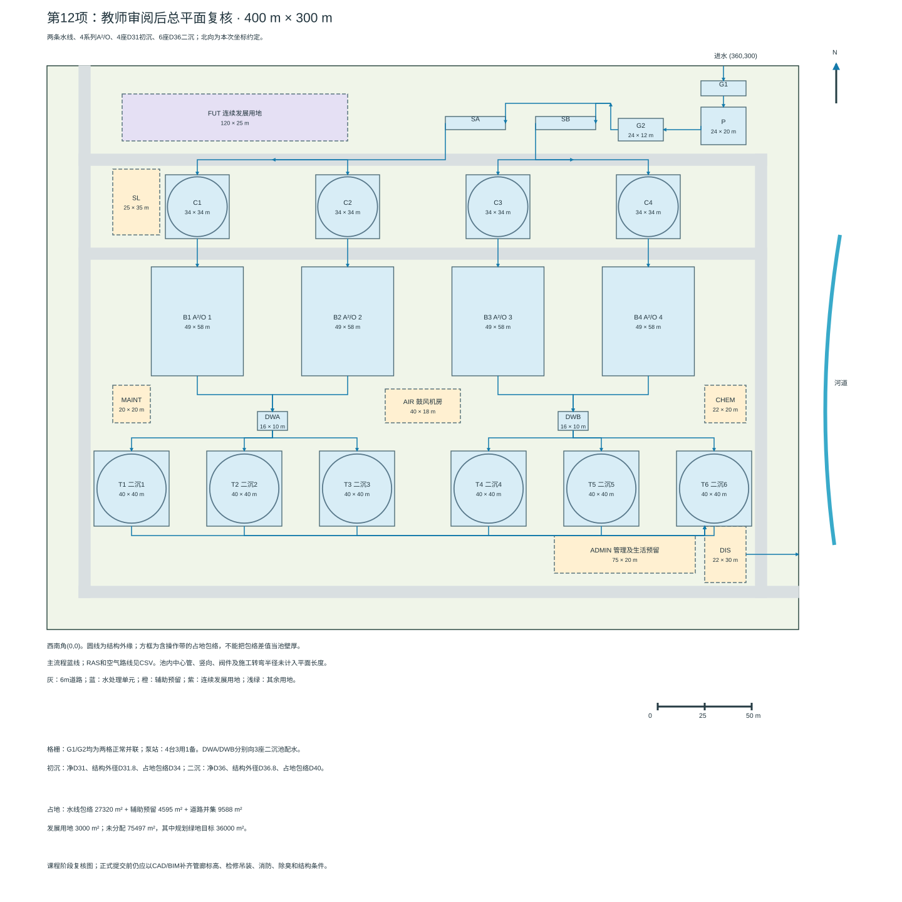

# 第12项 平面尺寸与占地初校

状态：已完成条件性平面初校，供用户审核。日期：2026-09-09。

本项按用户“继续第12项”的指令单独推进。核对最新仓库后，第10项二沉池和第11项管渠尚无成果，也无待合并PR。因此，本项使用第4–9项已有尺寸与明确的占地预留完成几何初校，不将二沉池暂定尺寸、管线长度及附属建筑视为已完成详细设计。第3项按用户进入第12项的指令记为接受继续使用，原有水质和能力复核条件保留。

## 1 初校结论及交付物

在下述外包尺寸、四座二沉预留及辅助设施假定下，主要水线可以布置在400 m×300 m厂界内。全部设施包络互不重叠、不压所画道路，面积账相加为120000 m²。此结论仅说明当前方案的平面容纳能力，不证明消防、结构、臭气防护、全厂水力或最终处理能力已经满足要求。

| 交付物 | 用途 |
| --- | --- |
| [平面初校图](第12项附件/平面初校.svg) | 带厂界、比例尺、北向、风向、设施编号、道路与主水线 |
| [构筑物坐标表](第12项附件/构筑物坐标.csv) | 全部24个设施/预留地块的坐标、包络与状态 |
| [管线平面长度表](第12项附件/管线平面长度.csv) | 33条水线、RAS和空气连接路径，含折点坐标 |
| [面积校核结果](第12项附件/面积校核.json) | 可复核的面积账、二沉面积筛查、各系列路径长度 |
| [生成与校核脚本](../scripts/build_layout12.py) | 使用Python标准库，从同一组坐标生成附件并校核重叠/越界 |

## 2 布置依据及坐标约定

任务书给定厂区12公顷、地面标高27.3 m，厂区图边长400 m和300 m；进水位于北侧、距东墙40 m；河道在原图右侧；夏季主导风向为东南。原图无完整测量坐标与河岸距离，本次以图上方为北、右方为东，西南角为(0,0)，x向东、y向北，单位m；这是布置约定，不是测量成果。

由此进水厂界接口为(360,300)。出厂接口初选(400,80)，仅确定到东侧厂界，厂界至实际河岸的长度、位置、护岸和排放许可条件未定，不能把厂外管长记为0。

教案PDF第48、50页要求两条并联线路、考虑进出水方向、构筑物间距、道路绿化、两个大门以及指北针和构筑物一览表。第49页是布置示例，本项不套用其尺寸。GB 50014-2021第7.2.2–7.2.5条（书内44页，PDF52）要求结合功能、流程、气候、维护及发展用地组织布局；并未给出所有构筑物统一采用一个固定净距的依据。本项道路宽度和设施间距均为工程预留，不能称为已验证的规范最小值。

## 3 工艺与功能分区

北侧固定进水，经粗格栅、提升泵站和细格栅进入两座曝气沉砂池；沿北侧配水走廊分别进入A、B两条水线。四座初沉池、四组A²/O及四座二沉预留沿北—南串联。A线为1、2系列，B线为3、4系列；处理主体关于x=200对称，前端因进水位置固定不强求几何对称。二沉后沿南侧汇水走廊向东汇入消毒计量预留区，再至东厂界。

管理生活用地预留在东南侧，靠管理门，处于夏季东南风的相对上风方向；主要水线在其西北及北侧。东南风意味着从东南吹向西北，不能反画。此为气候定性安排，不替代风玫瑰统计和臭气扩散分析。污泥转运接口置于西北侧邻物流道路；仅预留接口和运输操作地块，不设计独立污泥处理线。

北侧物流门初选(20,300)，东侧管理门初选(400,20)，路口宽度暂按6 m。道路环线中心为x=20、380和y=20、250，北侧物流门接入西侧道路；另在y=200设置横向道路、x=120和280设置纵向道路。机房、药剂区等仍需在未分配用地中细化支路、硬化操作坪及吊装平台。概念直角路口尚未绘制车辆转弯圆弧；必须按车辆轨迹和消防要求补充后才能确认交通可达性。

初沉旁路不作为正常主流程，本轮未给出其施工路线。事故、检修联通和超越通道可利用道路地下走廊预留，详细走向、阀门和可接受去向须在管网设计时另定，不能将未经处理污水直接出厂视为默认运行方式。

## 4 尺寸、外包与占地口径

内部工艺净尺寸与占地外包分开列示。外包包含本阶段拟留墙体、部分检修操作和构造余量，不是已完成的结构外缘设计。圆池按外包直径的外接正方形计地，避免把圆池角部全部提前算作可用绿地。所有净尺寸继承第4–9项，本轮不调整池容。

| 单元 | 已有净尺寸/依据 | 本项占地包络 | 数量 | 合计m² |
| --- | --- | --- | ---: | ---: |
| 粗格栅槽群G1 | 第4项每线每级1用1备，槽宽1.53 m | 24×8 m整体预留 | 1 | 192 |
| 提升泵站P | 第5项集水池16×10 m | 24×20 m，含池及检修预留 | 1 | 480 |
| 细格栅槽群G2 | 第4项槽宽2.15 m，四槽 | 24×12 m整体预留 | 1 | 288 |
| 曝气沉砂SA/SB | 第6项30×3.3 m | 每座32×7 m，含砂槽等预留 | 2 | 448 |
| 初沉C1–C4 | 第7项净D28 m | 每座外包D30 m，按30×30 m计地 | 4 | 3600 |
| 生物B1–B4 | 第8项净54×45 m | 转为南北向，东西49×南北58 m | 4 | 11368 |
| 二沉T1–T4 | 第10项缺失，暂按净D44 m筛查 | 每座外包D46 m，按46×46 m计地 | 4 | 8464 |
| 消毒计量DIS | 大纲完善项未计算 | 22×30 m预留，不代表有效池容 | 1 | 660 |
| 加药CHEM | 第3项补碳/补碱/辅助除磷接口 | 22×20 m总用地预留 | 1 | 440 |
| 鼓风机房AIR | 第9项6台鼓风机，设备尺寸未定 | 40×18 m预留 | 1 | 720 |
| 管理生活ADMIN | 建筑不在本轮计算范围 | 75×20 m用地预留 | 1 | 1500 |
| 污泥转运接口SL | 独立污泥线不在本轮范围 | 25×35 m预留 | 1 | 875 |
| 维修配电MAINT | 辅助建筑未设计 | 20×20 m用地预留，分隔及安全间距另核 | 1 | 400 |
| 连续发展地FUT | 保留发展可能性 | 120×25 m，非确定扩建单元 | 1 | 3000 |

生物池净宽45 m由多廊道组成，49 m外包的增量要容纳外墙、廊道墙及局部构造；58 m长度也仅为预留。最终隔墙、渠道或操作平台超过外包时，应更新坐标与面积，不能压缩有效池容去迁就图形。

二沉预留的几何筛查如下，仅用于判断预留是否具有合理数量级：

$$
A_{2,\mathrm{screen}}=4\times\frac{\pi 44^2}{4}=6082.12\ \mathrm{m^2}
$$

$$
q_{\mathrm{peak}}=5850/6082.12=0.9618\ \mathrm{m^3/(m^2\cdot h)}
$$

接近第3项初选的1.00 m³/(m²·h)。这不是第10项计算完成：尚未计入二沉固体负荷、化学污泥、沉降性能、堰口、污泥区及最终池数。若第10项结论不同，首先回改T1–T4预留，不反向要求第10项维持D44。

## 5 坐标与净距校核

四系列x中心依次为80、160、240、320。初沉中心y=225，二沉预留中心y=80；生物包络的y范围为135–193，x范围为各中心±24.5。完整坐标见CSV，所有坐标均为外包边界或中心的明确几何定义。

主要净距按外包边界计算：

| 关系 | 算式 | 净距m |
| --- | --- | ---: |
| 相邻初沉包络 | 80−30 | 50 |
| 相邻生物包络 | 80−49 | 31 |
| 相邻二沉预留包络 | 80−46 | 34 |
| 初沉南缘至生物北缘 | 210−193 | 17 |
| 生物南缘至二沉北缘 | 135−103 | 32 |
| y=200道路南缘至生物北缘 | 197−193 | 4 |
| y=200道路北缘至初沉南缘 | 210−203 | 7 |
| 最东生物包络至加药地块西缘 | 350−344.5 | 5.5（横向走廊，纵向错开） |

最北粗格栅外包至北界为300−292=8 m；最东设施外包至东界为400−372=28 m；管理区南缘至南界为30 m。门口道路到达厂界属有意设计，不按构筑物越界处理。上述几何空隙不代表已满足卫生防护、开挖放坡、基坑支护、消防或吊装要求。

校核脚本检查全部24个地块两两无面积交叠、均在边界内，且与道路矩形无面积交叠。圆池使用方包络使校核偏保守。未检查地下不同标高管线、设备检修运动范围或道路转弯包络，不能扩大解释。

## 6 厂区面积账

总用地：400×300=120000 m²=12.00 ha。各类地块无重叠，道路按矩形并集计算，交叉口只计一次：

$$
A_{\mathrm{road}}=\left|\bigcup_{j=1}^{7} R_j\right|=12204\ \mathrm{m^2}
$$

| 用地分项 | 面积m² | 占全厂比例 |
| --- | ---: | ---: |
| 已算水线单元外包（G1至生物池） | 16376 | 13.65% |
| 二沉与附属设施预留 | 13059 | 10.88% |
| 所画道路并集 | 12204 | 10.17% |
| 连续发展地 | 3000 | 2.50% |
| 尚未分配用地 | 75361 | 62.80% |
| 总计 | 120000 | 100.00% |

尚未分配用地并非全部绿地。本项将36000 m²（全厂30%）作为后续绿化分配目标，余39361 m²用于增加支路/硬化坪、管廊、建筑及设施调整、施工与维护留地。这两项属于75361 m²内部的面积分配意向，不能再次加到总用地之外；30%是本轮规划目标，不是本项核定的法定绿地率，图中未绘制实际绿地边界。

当前已定位包络、道路及发展地共44639 m²，占37.20%。因此在课程水线范围和当前预留假定下，没有出现总面积不足；仍不能据此宣称完整污泥线、所有生活建筑或未来等规模扩建均可容纳。连续发展地仅3000 m²，其几何形状也限制可放置的设施类型。

## 7 连接路径及水力接口

各管线按折线中心线坐标求平面长度：

$$
L_{xy}=\sum_j\sqrt{(x_{j+1}-x_j)^2+(y_{j+1}-y_j)^2}
$$

本图采用水平/竖直折线，因此单段可直接按坐标差复算。接口设置在各单元外包边界；不含单元内部渠道、中心进水管、竖向爬升、泵房内部管件或厂外排水段。生物池北端接初沉，南端接二沉是本项接口约定，需与第8项具体廊道进出水构造匹配。

| 路径 | 平面长度m | 使用限制 |
| --- | ---: | --- |
| 泵站外包出水至细栅外包入口 | 22 | 不能直接替换第5项单泵50 m等效总长，须补内部和竖向并剔除等效长度中的重复局部损失 |
| 沉砂A至初沉分配节点 | 111.5 | 与B线39.5 m不相等，配水应采用可调闸门/堰及水力校核 |
| 初沉至生物，每系列 | 17 | 单元间外接长度 |
| 生物至二沉，每系列 | 32 | 不包含二沉池内中心进水 |
| 二沉1/2/3/4至消毒预留 | 301/221/141/61 | 含共用南侧汇水干线，四条不能直接相加作为材料量 |
| RAS外包接口至厌氧入口1/2/3/4 | 174/174/174/170 | 避开鼓风机房及其他地块，支管、阀门、竖向另计 |
| 鼓风机房至生物接口1/2/3/4 | 127/47/47/127 | 含共用空气干线；需重新检查第9项6 kPa暂估阻力 |
| 消毒预留至东厂界 | 28 | 厂界至河道距离未知 |

分别串联从固定进水口至出厂口的所有外接段，1–4系列得到660、580、380、300 m。当前最长为A线第1系列，可作为第13项重点检查的候选水线，**最长路径不必然就是最大总水头损失路径**；管径、局部损失、含回流量及下游控制水位不同，仍应比较全部路径。

主水线为图中蓝线；回流污泥和空气路径为避免叠线遮挡单独列入CSV。内回流位于生物单元内部，本项未重复绘制或计算长度。污泥收集、投药管、事故联通管等仅有用地和通道预留，没有逐段确定，不能以33条路径表冒充完整管网工程量表。

## 8 待闭合条件

1. 第10项最终二沉池池数、尺寸、固体负荷和堰口应替换本项四座D44预留；有变化即重新运行脚本并核对道路与管线。
2. 第11项用本项折点坐标确定外接管长，补齐单元内部和竖向段，逐段确定流量、断面、坡度、材质及交叉标高，不能直接沿用早期统一50 m等效长度。
3. 第13项确认组号与最高洪水位，校核一次提升后能否重力出厂；不确定实际河岸位置前，厂外段长度和损失保持缺项。
4. 栅槽并列方式、机房设备布置、加药罐容、消毒形式和操作场地仍需详细核对；不足时使用未分配用地调整，不强压进现有预留框。
5. 双门接入外部道路的可行性、车辆转弯、消防、实际绿地、卫生防护、臭气收集及地下管线间距均未在本项验证。原图没有测量北向，正式CAD/BIM前需确认坐标与方向。
6. 第3项关于补碳、补碱、化学除磷及低温生物能力的条件继续有效，平面能放下不等同于工艺达标。

## 9 验证与复用

在仓库根目录执行 `python3 scripts/build_layout12.py`，无需第三方库。脚本生成坐标CSV、管线CSV、SVG和面积JSON，同时校核地块边界、两两重叠、道路冲突及总面积账。面积使用矩形分割的精确并集，不采用图片像素估算。SVG已渲染检查图例、编号、比例尺和完整厂界。

资料依据：任务书原始厂区图及总平面要求；教案PDF48–50；仓库第3–9项；GB 50014-2021书内43–44页（PDF51–52）第7.1.7–7.1.10、第7.2.1–7.2.5条。规范已有本地缓存，本轮按页查阅，无全文OCR。此成果供课程初校审核，不是正式施工图或CAD/BIM定稿。
